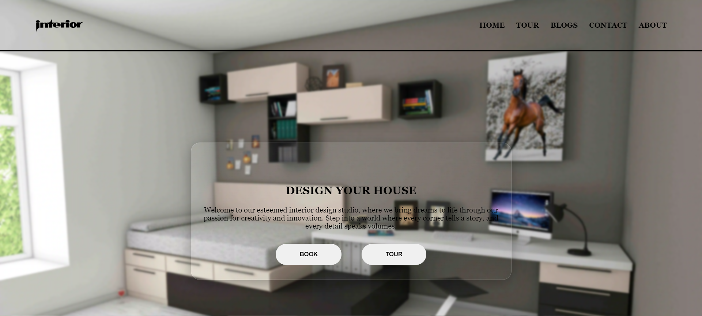
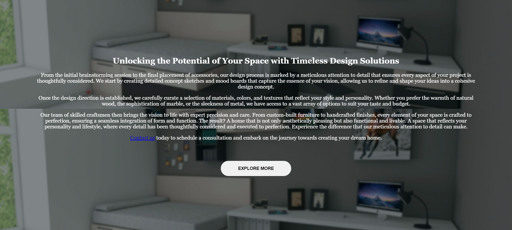

<h1 align="center">House Interior Website</h1>

This project is a comprehensive interior website designed to captivate and engage visitors from the moment they land on the site. It features a dynamic and visually appealing layout.

## Projects Demo Image
This project is a simple and elegant interior design website. It features a clean and responsive design, with the following key components:
- Navigation Bar: A stylish navigation bar that allows users to easily access different sections of the website.
- Front Page: The main page includes a welcoming message with options for booking a design consultation or scheduling a tour.
- About Us Page: An additional page providing details about the company, our mission, and the services we offer.
<h3 align="center">Demo Images</h3>

## Contributing
If you'd like to contribute to this repository, please fork the repository and use a feature branch. Pull requests are welcome.

## Contact
If you have any questions or suggestions, feel free to contact me at maneeshkurmii@gmail.com.
