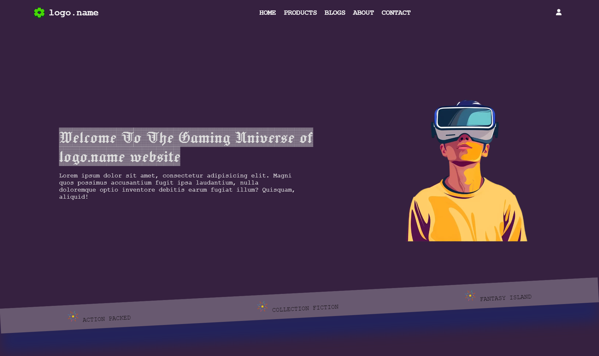
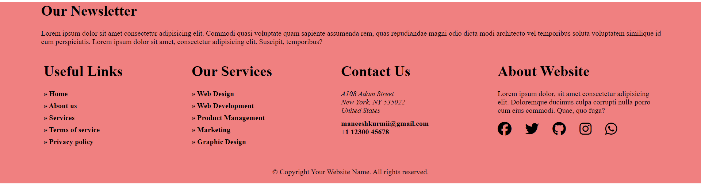
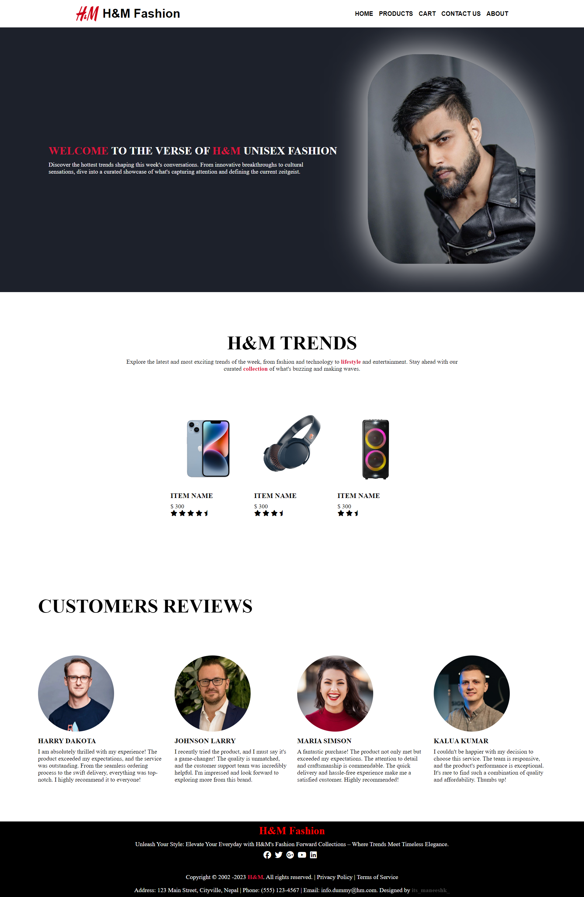

<h1 align="center">🚀 Mine All Unfinished Web Projects</h1>

Welcome to my web development projects repository! This collection showcases the various small projects I have created while practicing HTML, CSS, and Django. Each project is a demonstration of specific skills and concepts I've learned along the way.

## Projects

Below is a list of my projects. Each project includes a brief description and a demo image to give you an idea of what it looks like.

1. ## Gaming Front Page Website
   - Description: A sleek and modern front page for a gaming website, showcasing the latest games, news, and events in the gaming world.
   <h3 align="center">Demo Images</h3>
   <h3 align="left">Preview 1</h3>
   

2. ## Interior Webpage
   - Description: This project is a simple and elegant interior design website.
   <h3 align="center">Demo Images</h3>
   <h3 align="left">Preview 1</h3>
   
   <h3 align="left">Preview 2</h3>
   
   
3. ## Website Footer Component
   - This repository contains a complete footer component for a website, including all the basic requirements commonly found in footers.
   <h3 align="center">Demo Image</h3>
   <h3 align="left">Preview 1</h3>
   
   
4. ## RocketX - A complete Header & Footer
   - This repository contains a complete header & footer component for a website, including all the basic requirements commonly found in header & footer.
      <h2 align="center">Demo Image</h2>
      <h3 align="left">Preview 1</h3>
      

5. ## H&M Store - A complete front page webpage
   - This project showcases a modern, sleek, and user-friendly design for an e-commerce fashion website.
      <h2 align="center">Demo Image</h2>
      <h3 align="left">Preview 1</h3>
      <src=".demo-images/H&M-Store-demo-image.png" alt="Page Demo">
      
      
6. ## UpComming Soon...

## Contributing
If you'd like to contribute to this repository, please fork the repository and use a feature branch. Pull requests are welcome.

## Contact
If you have any questions or feedback, feel free to reach out:

- [Twitter](https://twitter.com/@its_maneeshk_)
- [LinkedIn](https://www.linkedin.com/in/itsmaneeshk/)
- [Email](mailto:maneeshkurmii@gmail.com)
